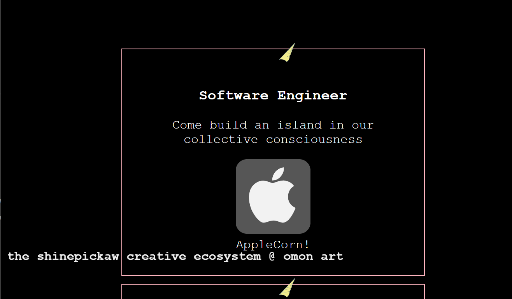

## Footer

We have a router view, and previously had a footer following this.

The footer is not a part of the document flow of hirable. 

The solution is either to make the footer different on different views, or, to make it a part of the document flow, and to keep the home page a single screen affair. 

## Ranging Spinner

Pass in a prop via binding on the component in the template. 

Bind the class of the spinner to a computed object which uses prop, so we can pass the search event on to make the spinner appear + animate, and disappear.

## Job List

Keep caption as an invisible span, which pops up as an absolutely positioned element, and plays an animation, going from visible to invisible. 

We will hang the user for 700ms until the animation finishes, before loading the posting. 

The 'card' container for each unicorn will be a flexbox and will wrap the icon + flavortext below the desc by setting flex-wrap. 

We import images by name, which we grab from the job results json returned by the server. We use lightweight SVGs for the icons. src attribute is bound via Webpack's require method to entry.compName + '.svg.'

We can write javascript expressions in the template to perform string manipulation (toUpperCase... etc)

Animation events need to be prefixed by vendor (moz, MS, webkit, etc). We add animationend event listeners to anything that needs to occur in reaction to an animation resolutioning. We use the bind method to our callback for this to tack on some parameters. 

The caption will be appended to the card to correctly position offset where to display the caption to (cursor location). We animate it by adding the animation property via classList.add(). window.open() is used to render from a URL. 

textNodes have a nodeType of 3. We loop through childNodes of the caption to remove all previous text content by nodeType after the animation has ended (removeChild(node: Node))

We save to localStorage a collected unicorn by simply getting liveUnicorns, parsing it as JSON, pushing the entry clicked if it is not already in localStorage. 